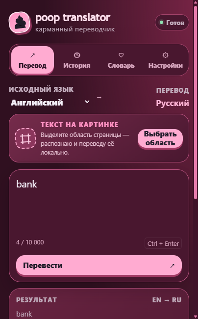

<div align="center">
  

# poop translator

**Бесплатный персональный переводчик между английским и русским для Google Chrome**

[](https://www.google.com/chrome/)
[](public/manifest.json)
[](https://www.typescriptlang.org/)
[](LICENSE)

Тёмный ягодно-розовый интерфейс, конфетные акценты, крупный текст и несколько вариантов перевода. API-ключ, аккаунт и подписка не нужны.
</div>



## Что умеет

| Возможность | Как работает |
| --- | --- |
| Перевод выделения | Рядом с выделенным текстом появляется компактная кнопка и карточка результата |
| Контекстное меню | Отдельные команды для перевода на русский и английский |
| Ручной перевод | Ввод текста в popup с направлениями EN → RU, RU → EN и EN ↔ RU |
| Варианты значений | Встроенный словарь FreeDict показывает несколько значений слов и коротких фраз |
| Перевод страницы | Основной текст страницы переводится целиком, оригинал возвращается одним нажатием |
| Перевод области | Рамка распознаёт английский или русский текст на странице и картинке, затем переводит его |
| История и словарь | Результаты можно сохранить, отредактировать, найти и удалить |
| Резервная копия | Историю, словарь и настройки можно экспортировать в JSON и безопасно объединить при импорте |
| Настройки | Управление языком, историей, кнопкой выделения и размером текста 100/115/130% |

Все пользовательские данные хранятся в `chrome.storage.local`. Переводы страниц не попадают в историю. Расширение не отправляет текст и снимки на сторонние серверы: перевод выполняет встроенный Chrome Translator API, OCR — встроенный в сборку Tesseract.js, а дополнительные значения читаются из локальных файлов расширения. Снимок выбранной области обрабатывается в памяти и не сохраняется.

## Установка

### Готовая сборка

1. Скачайте репозиторий через **Code → Download ZIP** и распакуйте архив.
2. Откройте `chrome://extensions` в Google Chrome 138 или новее.
3. Включите **Режим разработчика**.
4. Нажмите **Загрузить распакованное расширение**.
5. Выберите папку `dist`.
6. Закрепите **poop translator** на панели Chrome и обновите уже открытые вкладки.

### Первая подготовка

Откройте popup, выберите направление, перейдите в **Настройки** и нажмите **Подготовить**. Chrome бесплатно скачает языковой пакет; в автоматическом режиме подготавливаются обе пары EN ↔ RU. Первый запуск требует интернета, после него перевод выполняется на устройстве.

Chrome создаёт локальный переводчик только после пользовательского клика. Поэтому при переводе всей страницы внизу вкладки появляется небольшое подтверждение **Начать**. После клика работа продолжится, даже если popup закрыть.

Для текста внутри картинки нажмите **Выбрать область** в popup или `Alt+Shift+P`, затем обведите нужный фрагмент. Модели OCR для английского и русского уже входят в `dist`; отдельная загрузка для распознавания не нужна. Распознанный текст можно исправить перед повторным переводом.

## Интерфейс

- по умолчанию включён крупный масштаб 115%; доступны 100% и 130%;
- тёмная ягодно-розовая палитра, конфетно-розовые кнопки и значок-наклейка;
- аккуратные анимации и скруглённые карточки;
- полностью русский интерфейс;
- карточка измеряет свою высоту и открывается вверх у нижнего края окна.

## Ограничения Chrome

- Translator API и Language Detector API работают только в поддерживаемом настольном Chrome.
- На страницах `chrome://`, в Chrome Web Store и во встроенном просмотрщике PDF content script запрещён. Ручной перевод через popup остаётся доступен.
- Перевод страницы обрабатывает основной DOM-текст на момент запуска. Текст на видимой картинке или canvas можно перевести через выбор области; невидимая часть, PDF, поля форм, код и закрытый Shadow DOM не обрабатываются.
- Разрешение на сайты нужно для снимка видимой вкладки после явного выделения области. Расширение не делает фоновые снимки.
- Если сайт изменил текстовый узел после перевода, восстановление не перезаписывает это новое содержимое.

## Разработка

Для локальной разработки и CI используется Node.js 24 LTS (проверено на 24.14.1). Версия закреплена в `.node-version` и `package.json`.

```powershell
npm ci
npm test
npm run typecheck
npm run build
npm run smoke
npx playwright install chromium
npm run smoke:browser
npm run smoke:ocr
```

Сборка создаёт папку `dist`, которую можно загрузить в Chrome. Иконки генерируются локально из `public/icons/poop.svg`.

Браузерный smoke запускает видимый Chromium с временным профилем; на Linux нужен графический сеанс или Xvfb. Переводчик в popup подменяется тестовой заглушкой, но OCR выполняется настоящим локальным Tesseract. `npm run smoke:ocr` отдельно проверяет снимок, обрезку и распознавание `HELLO OCR` и `ПРИВЕТ`. Команда `npm run smoke:real` проверяет настоящий Chrome Translator API и завершается ошибкой, если языковой пакет не загрузился. CI выполняет тесты, типы, сборку и файловый smoke. Подробнее: [проверки и ручная приёмка](docs/testing.md).

## Детали поведения

- Ручной ввод ограничен 10 000 символами; сочетание Ctrl+Enter / Cmd+Enter запускает перевод.
- История содержит до 500 последних записей. Повтор одного запроса не дублируется; новый перевод того же текста может стать новой записью.
- Словарный поиск работает по точному нормализованному совпадению: до 80 символов и пяти слов. Показывается до восьми дополнительных значений без основного перевода. Это не полный перечень значений и не подбор по контексту; словоформы могут не находиться.
- Автоматический режим выбирает только между английским и русским. При неопределённости используется английский; другие языки не поддерживаются как отдельные направления.
- Перевод страницы следует выбранному направлению. В автоматическом режиме язык определяется для каждого фрагмента, поэтому смешанная страница может остаться двуязычной.
- Content script работает только в верхнем документе: текст внутри iframe не обрабатывается. На HTTP-странице кнопка может появиться, но доступность встроенного API зависит от контекста браузера; при ошибке можно перенести текст в popup.
- Создание модели ограничено ожиданием 180 секунд. Это ограничение ожидания расширения, а не гарантия отмены загрузки Chrome.
- OCR поддерживает локальные модели `eng`, `rus` и совместный режим. Качество зависит от размера, контраста, шрифта и чёткости изображения.
- Локальные данные не синхронизируются. Экспорт создаёт JSON на устройстве; импорт объединяет уникальные записи и применяет настройки из файла. Удаление расширения удаляет его хранилище, поэтому заранее сохраните резервную копию. Сброс данных расширения не удаляет языковые компоненты Chrome.

## Документация проекта

- [Инструкции для агентов](AGENTS.md)
- [Архитектура](docs/superpowers/specs/2026-09-12-poop-translator-design.md)
- [Проверки и ручная приёмка](docs/testing.md)
- [Обновление встроенного словаря](docs/dictionary.md)
- [Аудит и приоритеты развития — 13 сентября 2026](docs/audit-2026-09-13.md)
- [История изменений](CHANGELOG.md)

```text
src/                  popup, service worker, content script и общая логика
src/ocr/              offscreen-документ и локальный Tesseract worker
public/dictionary/    локальный словарь, разбитый на небольшие JSON-файлы
scripts/              сборка и smoke-проверки
tests/                модульные и интеграционные тесты
dist/                 готовое распакованное расширение
```

## Лицензии

Исходный код распространяется по лицензии [MIT](LICENSE).

Словарные данные основаны на FreeDict + WikDict и распространяются по CC BY-SA 3.0. Авторство, версия источника и описание преобразований приведены в [THIRD_PARTY_NOTICES.md](THIRD_PARTY_NOTICES.md).
