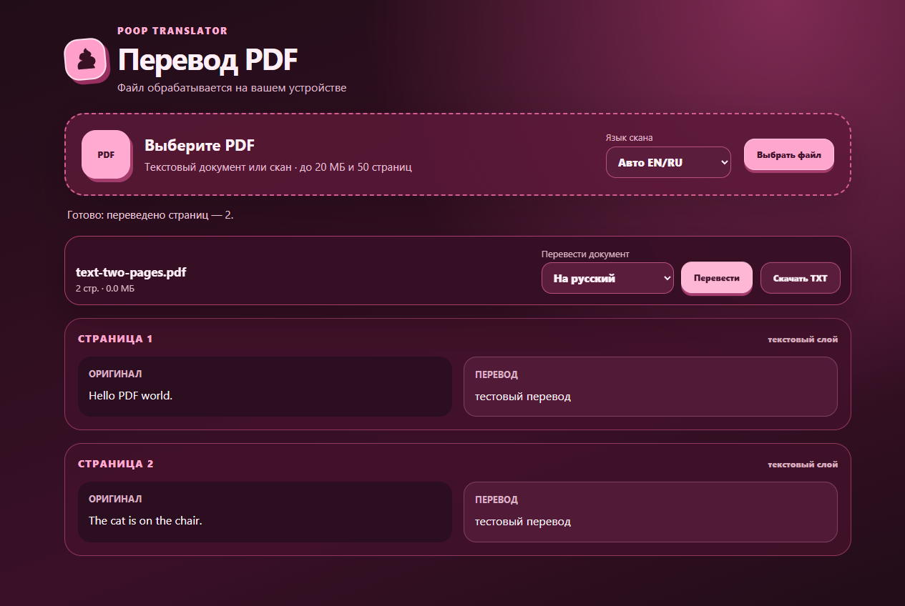

<div align="center">
  

# poop translator

**Бесплатный локальный переводчик 39 языков для Google Chrome**

[](https://www.google.com/chrome/)
[](public/manifest.json)
[](https://www.typescriptlang.org/)
[](LICENSE)

Тёмный ягодно-розовый интерфейс, конфетные акценты, крупный текст и несколько вариантов перевода. API-ключ, аккаунт и подписка не нужны.
</div>




## Что умеет

| Возможность | Как работает |
| --- | --- |
| Перевод выделения | Рядом с выделенным текстом появляется кнопка и перемещаемая карточка результата |
| Контекстное меню | Отдельные команды для перевода на русский и английский |
| Ручной перевод | 39 языков в каталогах источника и цели; доступность конкретной пары проверяется в Chrome |
| Варианты значений | Локальный словарь FreeDict показывает до восьми дополнительных значений для EN ↔ RU |
| Перевод страницы | Цель выбирается из каталога; основной текст переводится с возможностью возврата оригинала |
| Перевод области | Рамка локально распознаёт выбранный OCR-язык на странице или картинке, затем переводит текст |
| Перевод PDF | Отдельная вкладка читает текстовый PDF или локально распознаёт скан, переводит по страницам и сохраняет один TXT |
| История и словарь | Результаты можно сохранить, отредактировать, найти и удалить |
| Карточки повторения | Каждая пара словаря становится карточкой; оценки «Повторить», «Сложно», «Знаю» назначают следующий срок |
| Резервная копия | Историю, словарь, прогресс карточек и настройки можно экспортировать в JSON и объединить при импорте |
| Настройки | Языки перевода и OCR, язык страницы, история, кнопка выделения и размер текста 100/115/130% |

Все пользовательские данные хранятся в `chrome.storage.local`. Переводы страниц и PDF не попадают в историю. Расширение не отправляет текст, снимки и PDF на сторонние серверы: перевод выполняет встроенный Chrome Translator API, OCR — встроенный в сборку Tesseract.js, PDF читает локальный PDF.js, а дополнительные значения берутся из локальных файлов расширения. Снимки и PDF обрабатываются в памяти и не сохраняются.

## Установка

### Готовая сборка

1. Скачайте архив `poop-translator-v1.8.0.zip` из [GitHub Releases](https://github.com/pupa-jupa/poop-translator/releases) и распакуйте его. Версия в `public/manifest.json` — **1.8.0**.
2. Откройте `chrome://extensions` в Google Chrome 138 или новее.
3. Включите **Режим разработчика**.
4. Нажмите **Загрузить распакованное расширение**.
5. Выберите папку `dist`.
6. Закрепите **poop translator** на панели Chrome и обновите уже открытые вкладки.

### Первая подготовка

Откройте popup, выберите исходный язык и цель. Для явно выбранной пары Chrome при необходимости скачает её языковой пакет. В автоматическом режиме сначала определяется источник; если нужная пара ещё не загружена, нажмите **Подготовить и перевести**. Загрузка выполняется по одной паре, перевод остаётся локальным. Наличие языка в каталоге не гарантирует поддержку каждой пары конкретной версией Chrome.

Для всей страницы выберите исходный язык (или авто) и отдельную цель, затем подтвердите действие кнопкой **Начать** на странице. В авто-режиме источник определяется один раз по выборке текста страницы; если пара не загружена, появится **Подготовить и перевести**. При смешанных исходных языках выберите источник явно. Текст уже на выбранном языке остаётся оригинальным.

Для текста внутри картинки выберите **Язык OCR** в настройках, нажмите **Выбрать область** в popup или `Alt+Shift+P`, затем обведите нужный фрагмент. В `dist` входят десять OCR-моделей, включая японскую, корейскую и оба варианта китайской. Авто-OCR использует EN+RU; остальные языки выбираются явно, чтобы не загружать все модели в память. Распознанный текст можно исправить перед повторным переводом.

Чтобы учить сохранённые слова, откройте вкладку **Карточки**. Сначала вспомните ответ, затем нажмите **Показать перевод** и оцените себя. Новые пары доступны сразу. «Повторить» возвращает карточку через 10 минут, «Сложно» — завтра, а «Знаю» постепенно увеличивает интервал. Прогресс сохраняется локально вместе со словарём.

Для PDF нажмите **Открыть PDF** на вкладке перевода. Выберите файл или перетащите его, укажите OCR-язык для сканов, дождитесь чтения страниц, задайте исходный язык (или авто) и цель, затем нажмите **Перевести**. В авто-режиме одна исходная пара выбирается по выборке документа; для смешанного документа укажите источник явно. После 20 МиБ или 50 страниц приложение попросит подтвердить обработку; предел — 100 МиБ и 200 страниц. Страницы без текстового слоя проходят локальный OCR. **Скачать TXT** сохраняет один общий файл с результатом по порядку страниц; исходная вёрстка PDF в TXT не переносится.

При неуверенном распознавании расширение дополнительно обрабатывает светлые надписи на цветном фоне. Если результат остаётся слабым, сначала предлагает проверить текст и нажать **Перевести этот текст**. Выделяйте надпись с небольшим отступом: лишние детали картинки могут мешать OCR.

## Интерфейс

- по умолчанию включён крупный масштаб 115%; доступны 100% и 130%;
- тёмная ягодно-розовая палитра, конфетно-розовые кнопки и значок-наклейка;
- аккуратные анимации и скруглённые карточки;
- полностью русский интерфейс;
- карточка измеряет свою высоту, открывается вверх у нижнего края окна и перемещается за кнопку мышью или стрелками клавиатуры; Shift+стрелка двигает на 1 пиксель.

## Ограничения Chrome

- Translator API и Language Detector API работают только в поддерживаемом настольном Chrome.
- На страницах `chrome://`, в Chrome Web Store и во встроенном просмотрщике PDF content script запрещён. Для PDF используйте кнопку **Открыть PDF** в popup и выберите локальный файл.
- Перевод страницы обрабатывает основной DOM-текст на момент запуска. Текст на видимой картинке или canvas можно перевести через выбор области; поля форм, код и закрытый Shadow DOM не обрабатываются. PDF-раздел ограничен 100 МиБ и 200 страницами, а также бюджетами изображений и текста; экспортирует текст, а не исходный макет.
- Разрешение на сайты нужно для снимка видимой вкладки после явного выделения области. Расширение не делает фоновые снимки.
- Если сайт изменил текстовый узел после перевода, восстановление не перезаписывает это новое содержимое.

## Разработка

Для локальной разработки и CI используется Node.js 24 LTS (проверено на 24.14.1). Версия закреплена в `.node-version` и `package.json`.

```powershell
npm ci
npm test
npm run typecheck
npm run build
npm run smoke
npx playwright install chromium
npm run smoke:browser
npm run smoke:ocr
```

Сборка создаёт папку `dist`, которую можно загрузить в Chrome. Иконки генерируются локально из `public/icons/poop.svg`.

Браузерный smoke запускает видимый Chromium с временным профилем; на Linux нужен графический сеанс или Xvfb. Переводчик подменяется тестовой заглушкой, но OCR выполняется настоящим локальным Tesseract. `npm run smoke:ocr` отдельно проверяет снимок, обрезку и распознавание EN/RU/DE/JA/KO/ZH. Команда `npm run smoke:real` проверяет настоящий Chrome Translator API и завершается ошибкой, если языковой пакет не загрузился. CI выполняет тесты, типы, сборку и файловый smoke. Подробнее: [проверки и ручная приёмка](docs/testing.md).

## Детали поведения

- Ручной ввод ограничен 10 000 символами; сочетание Ctrl+Enter / Cmd+Enter запускает перевод.
- История содержит до 500 последних записей. Повтор одного запроса не дублируется; новый перевод того же текста может стать новой записью.
- Словарный поиск работает по точному нормализованному совпадению: до 80 символов и пяти слов. Показывается до восьми дополнительных значений без основного перевода. Это не полный перечень значений и не подбор по контексту; словоформы могут не находиться.
- Автоматический перевод может определить любой язык из каталога при достаточной уверенности Language Detector. Для очень коротких латинских слов без достаточных признаков используется английский; исходный язык можно выбрать вручную.
- Для перевода страницы источник выбирается один раз по выборке основного текста. Фрагменты уже на выбранной цели не меняются; при смешанных языках внутри одного текстового узла возможны неточные результаты.
- Content script работает только в верхнем документе: текст внутри iframe не обрабатывается. На HTTP-странице кнопка может появиться, но доступность встроенного API зависит от контекста браузера; при ошибке можно перенести текст в popup.
- Создание модели ограничено ожиданием 180 секунд. Это ограничение ожидания расширения, а не гарантия отмены загрузки Chrome.
- OCR поддерживает локальные модели `eng`, `rus`, `ukr`, `deu`, `fra`, `spa`, `jpn`, `kor`, `chi_sim`, `chi_tra`. Авто-режим объединяет EN+RU; для других языков выберите OCR-язык явно. Качество зависит от размера, контраста, шрифта и чёткости изображения.
- Локальные данные не синхронизируются. Экспорт создаёт JSON на устройстве; импорт объединяет уникальные записи и применяет настройки из файла. Удаление расширения удаляет его хранилище, поэтому заранее сохраните резервную копию. Сброс данных расширения не удаляет языковые компоненты Chrome.
- Схема хранения v4 автоматически читает v1–v3 без потери истории, словаря и карточек. Экспорт создаёт копию v4; импорт принимает v1–v4, сохраняя более позднюю оценку совпадающей пары.

## Документация проекта

- [Инструкции для агентов](AGENTS.md)
- [Архитектура изменений 1.8.0](docs/superpowers/specs/2026-09-22-large-pdf-expanded-languages-card-design.md)
- [Проверки и ручная приёмка](docs/testing.md)
- [Обновление встроенного словаря](docs/dictionary.md)
- [Аудит и приоритеты развития — 13 сентября 2026](docs/audit-2026-09-13.md)
- [История изменений](CHANGELOG.md)

```text
src/                  popup, service worker, content script и общая логика
src/ocr/              offscreen-документ и локальный Tesseract worker
public/dictionary/    локальный словарь, разбитый на небольшие JSON-файлы
scripts/              сборка и smoke-проверки
tests/                модульные и интеграционные тесты
dist/                 готовое распакованное расширение
```

## Лицензии

Исходный код распространяется по лицензии [MIT](LICENSE).

Словарные данные основаны на FreeDict + WikDict и распространяются по CC BY-SA 3.0. Авторство, версия источника и описание преобразований приведены в [THIRD_PARTY_NOTICES.md](THIRD_PARTY_NOTICES.md).
